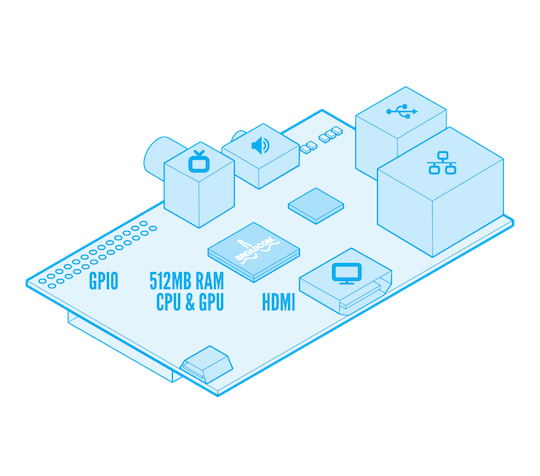
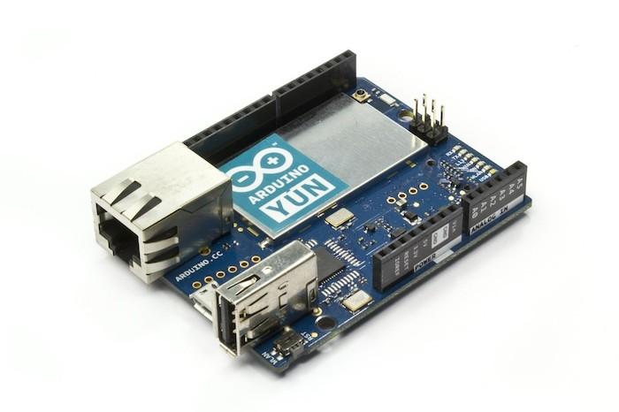
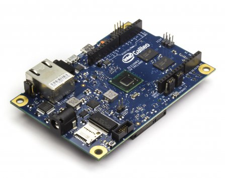
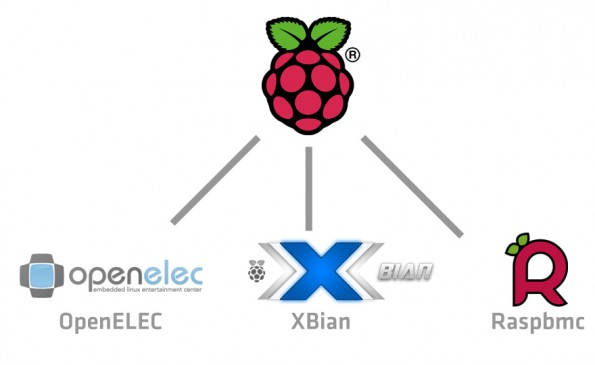
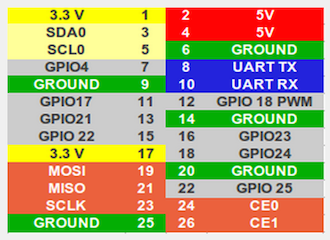
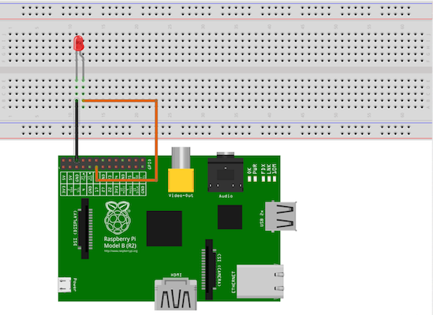
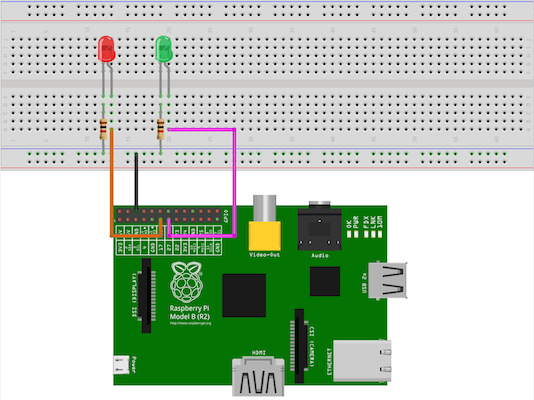

#How Raspberry Pi can ease your life

##Overview
Raspberry Pi, a 30€ credit-card sized microcomputer, was originally created to encourage kids to learn how to program. This is no longer the only use case of this board as it has become very popular in the DIY world. In this talk we will describe the board it self and several projects, both software and hardware, which could be done with it.

##Introduction
The Raspberry Pi is a 30€ credit-card sized computer that plugs into your TV and a keyboard. It is a capable little computer which can be used in electronics projects, and for many of the things that your desktop PC does, like spreadsheets, word-processing and games. It also plays high-definition video. It was created to be used by kids all over the world to learn programming.



The Raspberry Pi's core is a Broadcom BCM2835 system on a chip (SoC), which includes an ARM 700 MHz processor (although it could be overclocked up to 1GHz), VideoCore IV GPU and 521MB of RAM.
It also has Digital/Analog video output, 2 USB ports and an Ethernet port. Besides the "normal" I/O connections it also has 24 General Input Output Pins (GPIO), those pins could be used to work with simple things like switches and LEDs or something more complex like RFID encoders, etc.

There are two different models the Model A has 256MB RAM, one USB port and no Ethernet. The Model B has 512MB RAM, 2 USB ports and an Ethernet port. We will talk all the time about the Model B as the benefits we get from it are bigger than the price difference (aprox. 5€).

###Other single board computers
It seems that there is hipe with this low cost single board computers. This has helped some companies to introduce their own solutions, so we have:

- The Arduino Yum is the one that I like the most because is _open hardware_.

It is a microcontroller board based on the ATmega32u4 and the Atheros AR9331. The Atheros processor supports a Linux distribution based on OpenWRT named Linino. The board has built-in Ethernet and WiFi support, a USB-A port, micro-SD card slot, 20 digital input/output pins (of which 7 can be used as PWM outputs and 12 as analog inputs), a 16 MHz crystal oscillator, a micro USB connection, an ICSP header, and a 3 reset buttons.
- The Intel Galileo is a microcontroller board based on the Intel® Quark SoC X1000 Application Processor, a 32-bit Intel Pentium-class system on a chip.


##Basic set up
####What we need to start playing with our raspberry
- SD Card, an 8GB class 4 SD card is recommended – ideally preinstalled with NOOBS. You can buy a card with NOOBS pre-installed, or you can download it for free.
- Display and connectivity cables, any HDMI/DVI monitor or TV should work as a display for the Pi. For best results, use one with HDMI input, but other connections are available for older devices. Use a standard Ethernet cable for internet access.
- Keyboard and mouse, any standard USB keyboard and mouse will work with your Raspberry Pi. (Will see that this is optional)
- Power supply, use a 5V micro USB power supply to power your Raspberry Pi. Be careful that whatever power supply you use outputs at least 5V and more than 700mA; insufficient power will cause your Pi to behave in strange ways. If you use higher power you will fry your Pi!


####Quick start
Once we are sure that we have all the things that we need we can start.
First we have to download a Linux image to copy to the SD card. I would recommend to start always with a [Raspbian](http://www.raspbian.org/) image. It is our beloved Debian compiled for the Raspberry Pi.

Once we have the image we just need to copy it to the SD card (Assuming we are running a UNIX base operation system like Mac OS X)

```
➜  df -h
Filesystem      Size   Used  Avail Capacity  iused   ifree %iused  Mounted on
/dev/disk0s2   112Gi   87Gi   25Gi    78% 22881338 6531030   78%   /
devfs          184Ki  184Ki    0Bi   100%      636       0  100%   /dev
map -hosts       0Bi    0Bi    0Bi   100%        0       0  100%   /net
map auto_home    0Bi    0Bi    0Bi   100%        0       0  100%   /home
/dev/disk1s1    15Gi  2.5Mi   15Gi     1%        0       0  100%   /Volumes/RASPBIAN
➜  diskutil unmountDisk /dev/disk1s1
Unmount of all volumes on disk1 was successful
➜  sudo dd bs=1m if=wheezy-raspbian.img of=/dev/disk1s1
Password:
1300+0 records in
1300+0 records out
1363148800 bytes transferred in 652.654769 secs (2088622 bytes/sec)
```

And thats it, we have our Debian box ready to boot, just place the SD card in the Raspberry Pi and you are ready to start. A few questions will be asked to you like the language distribution and so on, nothing really serious.

There is a nicer solution to do this with a non terminal app, you can check it [herel](http://alltheware.wordpress.com/2012/12/11/easiest-way-sd-card-setup/).


Note: I said before that we need a usb keyboard and Mouse, well this is not fully true, we can use a Serial USB cable but to do so we need to install the drives on our machine. You can find more information about how to do it [here](https://learn.adafruit.com/adafruits-raspberry-pi-lesson-5-using-a-console-cable)

Once we have done this steps we have our Raspberry ready to perform any task we can thing about, of course always keeping in mind the limitations that its hardware has.

##Raspberry Pi Software Only
Although the hardware of our Raspberry Pi is quite limited if we compare it with nowadays desktop computers (even with some mobile phones) but we can think about some tasks that don't require lots of muscle and doings this tasks is what Raspberry Pi does better.

The first good point, besides the cost, that comes to my mind is the power consumption, idle consumes approximately 2 watts while running it can go up to 5 (maybe more), if we compare with any other desktop/laptop solution ...

As we mentioned before, it runs Linux, which means that we have a well known friend to work with.

There is a quite bast list of projects that could be done with the Raspberry Pi and only with it, meaning without any kind of extra hardware (besides the HDMI cable, power supply, etc.)

###Raspberry PI as Media Center
Before we installed Raspbian, which is a plain Debian installation. Now to better manage our media center we will install RaspBMC, which is a combination of Debian and XBMC. You can read more about this last one [here](http://www.raspbmc.com/).

This is the alternative that I prefer, it is a personal choice, there are several other options:




The installation procedure for RaspBMC is very easier:

```
wget http://svn.stmlabs.com/svn/raspbmc/release/installers/python/install.py
sudo python install.py
```

Note: if this procedure fails, you can always download the `img` file directly from the web and follow the same steps as for the RaspBian.

Once it finishes we have already our media center ready to start. Just plug it into the TV with HDMI and to the power supply.
If we have a relatively new TV, it will have HDMI with CEC support, which means that we can use the remote from the TV to control our XBMC installation because the Raspberry Pi will receive the orders from the remove via he HDMI cable. Otherwise there are other alternatives to overcome this problem like [Flirc](http://flirc.tv/)

Note: I'm not encouraging you to download illegal content with the next lines, it is just and example :)

Having our XBMC alone for some people is enough, it serves all the multimedia content that we put on it but for me is boring and in the long term time consuming, we can make some software additions to make even more useful for us.

Lets begin with Transmission, for me the best Bittorrent cliente. It is super easy to install.

```
sudo apt-get update
sudo apt-get install transmission-daemon
sudo service transmission-daemon stop
```

That's it, now we can configure Transmission to meet our needs `sudo vim /etc/transmission-daemon/settings.json`. The names of the configuration variables are self explanatory.
Typically the keys that you want to change are: 

```
"download-dir": "/media/data/complete",
"incomplete-dir": "/media/data/incomplete"
"rpc-username": "transmission"
```

Put the best values for you for the folders, and for the user I would recommend `pi`. I would also recommend to set a password for the online access, if you want to make easy to remember the same password as for the user `pi` could be used.

Once we save this file we can start the service again `sudo service transmission-daemon start` and we will have our Transmission client waiting for us in `http:/pi_address:9091` (unless we have change the port inside the configuration).

Something important to remark here is that you might want to have either a USB external hard disk or a NAS connected to the Raspberry as its own local storage usually it's quite limited. A simple [google search](https://www.google.fr/search?q=raspberry+pi+usb+disk&oq=raspberry+pi+usb+disk&aqs=chrome..69i57j0l5.420j0j9&sourceid=chrome&es_sm=119&ie=UTF-8) might help you.

This is now better than only XBMC but we can go one step further and we can automatise the downloads of our favourite TV Shows using [Flexget](http://flexget.com/) (There are for sure other alternatives but I found this one the more reliable and easier to configure). To install it we can run this commands:

```
sudo apt-get install python-pip 
sudo pip install flexget 
sudo pip install transmissionrpc
```

For this last part we need to create an account at [Trakt.tv](http://Trakt.tv), this site allows you to add tv shows to a list which Flexget then can read, and probably you want also an account in some RSS TV Show fedd like [http://showrss.info/](http://showrss.info/).

The config figuration file that I use for Flexget is this one (config.yml):

```
    templates:
      tvshows:
        exists_series:
          - /media/usb0/TV Shows/
          - /media/usb0/Downloads/incomplete
        regexp:
          reject:
            - FASTSUB
            - VOSTFR
            - Subtitulado
        content_filter:
          reject:
            - '*.rar'
            - '*.zip'
            - '*.avi'  
        transmission:
          host: localhost
          port: 9091
          username: 
          password: 
          path: /media/usb0/TV Shows/{{series_name}}/S{{"%02d"|format(series_season)}}  
        inputs:
          - rss: http://showrss.info/rss.php?user_id=&hd=2&proper=1&raw=true
          - rss: http://kat.ph/tv/?rss=1
          - rss: http://ezrss.it/feed/
          - rss: http://rss.bt-chat.com/?group=3
          - rss: http://extratorrent.com/rss.xml?cid=8
      movies:
        transmission:
          host: localhost
          port: 9091
          username: 
          password: 
          path: /media/usb0/Movies
     
    tasks:
      get_tvshows:
        priority: 1
        template: tvshows
        configure_series:
          from:
            trakt_list:
              username: 
              password: 
              api_key: 
              custom: Following in HD
          settings:
            quality: 720p hdtv
     
      get_tvshowshd:
        priority: 2
        template: tvshows
        configure_series:
          from:
            trakt_list:
              username: 
              password: 
              api_key: 
              custom: Following
          settings:
            quality: hdtv <720p

      cleanup:
        priority: 3
        clean_transmission:
          host: localhost
          port: 9091
          username: 
          password: 
          finished_for: 14 days

      
    schedules:
      - tasks: ['cleanup', 'get_tvshows', 'get_tvshowshd']
        interval:
          days: 1
          at_time: 4:00 am
```

You should change the folders to match yours.

Now we can tell XBMC to update its library when a new episode is added, to do so we need to create `/etc/transmission/xbmc-upd.sh` and add this content:

```
/usr/bin/wget --header='Content-Type:application/json' --post-data='{"jsonrpc": "2.0", "method": "VideoLibrary.Scan", "id": "xbian", "params": {"directory":"'"$TR_TORRENT_DIR"'/"}}' "http://localhost:8080/jsonrpc"
```

We can test that our Flexget is working simply typing:

```
flexget -c /media/usb0/Downloads/flexget/config.yml --test
```

If nothing went wrong, you can now go ahead and schedule Flexget. I choose to schedule it every 3 hours starting at 3 AM since I live Europe and between 2-6 AM most US tv shows from the previous evening become available. We will use crontabs, a new task can be added doing `crontab -e` and adding this line to the end of the file:

```
0 3,6,9,12,15 * * * nice -n 4 /usr/local/bin/flexget -c /media/usb0/Downloads/flexget/config.yml --cron
```

Now we have a nice media center!

##Raspberry Pi Software + Hardware
In this last section we are going to describe a bit how we can interact with the GPIO ports of our Raspberry Pi.

This is the the list of GPIO pins that we have available in the Pi. Typically we will use only the grey ones.


First thing we can do is turn on and off one LED, this is the equivalent to our well known 'Hello World' first project.
To so we need a LED, of course, and a couple of wires.

Now we can connect the LED to the GPIO 17 and to one of the ground pins of the Raspberry.
The result of connecting everything using a bread board should be something like this:



The way to access to the GPIO, pin 17 in our case, is like what we do with directories, so we will use commands like `ls`, `cat` or `echo`.

Right now we don't have any pin ready to work because we need to initialise them (or create them). To enable the GPIO 17 we just need to run the following command: 

```
echo 17 > /sys/class/gpio/export
```

After that the system will create a new file with the normal GPIO structure for the pin 17. Now we can read and write to this pin.
If we want to turn on our LED, we need to say to the Raspberry that our pin 17 is and output:

```
echo out > /sys/class/gpio/gpio17/direction
```

Now that the system already nows that this pin is an output, we can give it the value that we want to put in the LED, there are two different values `0` and `1` (What did you expect? )

To light up the LED we write a `1` in the pin:

```
echo 1 > /sys/class/gpio/gpio17/value
```

To turn it off:

```
echo 0 > /sys/class/gpio/gpio17/value
```

Once we have finished our tests we have to delete the directory that we create previously for pin 17:

```
echo 17 > /sys/class/gpio/unexport
```

This our "Hello World!". This way of working with the GPIO is a bit painful, instead we can create a little program, lets say in Python, that helps us work with the GPIO pins so we just need to focus on the logic of our program instead of creating directories.

For the python script we are going to use two LEDs and we are going to make them blink. And we will connect one of them to the GPIO pin 17 and the other one in the GPIO 27.
It should be something like this:



After setting up the wires we need to install the python library, to do so we need to download the library from SourceForge, we can use this command:

```
wget 'http://downloads.sourceforge.net/project/raspberry-gpio-python/RPi.GPIO-0.5.4.tar.gz'
```

Once it is downloaded we uncompress it and we can installed.

```
tar zxvf RPi.GPIO-0.5.4.tar.gz
cd RPi.GPIO-0.5.4/
#If python-dev is not installed jet
sudo apt-get install python-dev
sudo python setup.py install
```

Now we can write our little python program to make two LEDs blink.

```
import RPi.GPIO as GPIO
import time
GPIO.setmode(GPIO.BCM)
GPIO.setup(17, GPIO.OUT) ## GPIO 17 ouput
GPIO.setup(27, GPIO.OUT) ## GPIO 27 output

def blink():
	print "Starting blinking fever!"
	iteracion = 0
	while iteracion < 30: ## Blink for 30'
	    GPIO.output(17, True) ## On 17
	    GPIO.output(27, False) ## Off 27
	    time.sleep(1) ## Wait one second
	    GPIO.output(17, False) ## Off 17
	    GPIO.output(27, True) ## On 27
	    time.sleep(1) ## Wait one second
	    iteracion = iteracion + 2 ## Add 2 second, one for each blink
	print "I'm done!"
	GPIO.cleanup() ## Clean the GPIO
        
blink() ## Call the function
```

Now from the terminal we just run:

```
python blink.py
```

And that's it, very easy and fast. In fact this kind of code reminds a lot any kind of program with any small microcontroler, like the Arduino, so if you have worked with any of them just need to apply your knowledge.

LEDs are fun and they are the easiest way to start playing around with the Raspberry Pi but I want to show some nice project (really small one) so you can have an idea of what can be done with a Raspberry Pi.

To begin with, we can connect to our board a camera, in this case is not a USB camera, although it could be one of those, but we will be using the Pi camera. Raspbian doesn't have the libraries installed by default but they are really easy to install:

```
sudo apt-get update
sudo apt-get upgrade
sudo apt-get install python-picamera
```

The camera could be used to do several things, we will se how to see what the camera is view in realtime, take photos and video.

To get an image in realtime we can use this python script:

```
#!/usr/bin/python
import time
import picamera

with picamera.PiCamera() as picam:
    picam.start_preview()
    time.sleep(10)
    picam.stop_preview()
    picam.close()
```

To take a picture:

```
#!/usr/bin/python
import time
import picamera

with picamera.PiCamera() as picam:
    picam.start_preview()
    time.sleep(5)
    picam.capture('pic.jpg')
    picam.stop_preview()
    picam.close()
```

In this example the photo is saved as `jpg` but several formats could be used `png`, `gif`, `bmp`, `yuv`, `rgb` and `raw`. Which sometimes might be useful.

Finally to record video:

```
#!/usr/bin/python

import time
import picamera

with picamera.PiCamera() as picam:
	picam.start_preview()
	picam.start_recording('video.h264')
        picam.wait_recording(20)
        picam.stop_recording()
	picam.stop_preview()
	picam.close()
```

In this example is important to use `picam.wait_recording()` instead of `time.sleep()` as the former one does some extra things like checking if there is enough space on disk to continue recording.

The camera has a huge variety of possible configurations, it allows to configurate the ISO, the aperture, etc and it also has some basic photo effects that can be applied to the image on the fly. More information about the library could be found [readthedocs](http://picamera.readthedocs.org/en/release-1.0/index.html).

Now we can combine the camera with some third party application lets say Telegram, and we can send the image to any of our contacts.
First we need to install Telegram:

```
git clone https://github.com/vysheng/tg.git && cd tg
sudo apt-get install libreadline-dev libconfig-dev libssl-dev lua5.2 liblua5.2-dev
./configure
make
```

If we want to check that Telegram is ready we can simple call `./telegram -k tg-server.pub`. The first time it will ask us for our mobile phone including the country code, something like `+41 666 666 666`.

You can see all the commands that you have by typing `help` and you can send a message to any of your contacts like this:

```
msg Esteban_Suizo 'test'
```

Now we are going to use this to send a picture from python, but first we need to install a few things:


```
sudo apt-get install python-pip
sudo pip install pexpect
```

And our little program to send a picture could be something like this:

```
#!usr/bin/env
import pexpect
import picamera
import time

contact = "Esteban_Suizo"
msg = "Test from Python!!"
img = "/home/pi/prueba.jpg"

with picamera.PiCamera() as picam:
    picam.capture(img)
    picam.close()                          

telegram = pexpect.spawn('./telegram -k tg-server.pub')
telegram.expect('0m')
telegram.sendline('msg ' + contact + ' ' + msg)
telegram.sendline('send_photo ' + contact + ' ' + img)
telegram.expect('100', timeout=1200)
telegram.expect('photo')
print ('We are awesome, the picture is sent!')
telegram.expect('0m') 
telegram.sendline('quit')
```

#That's all folks

